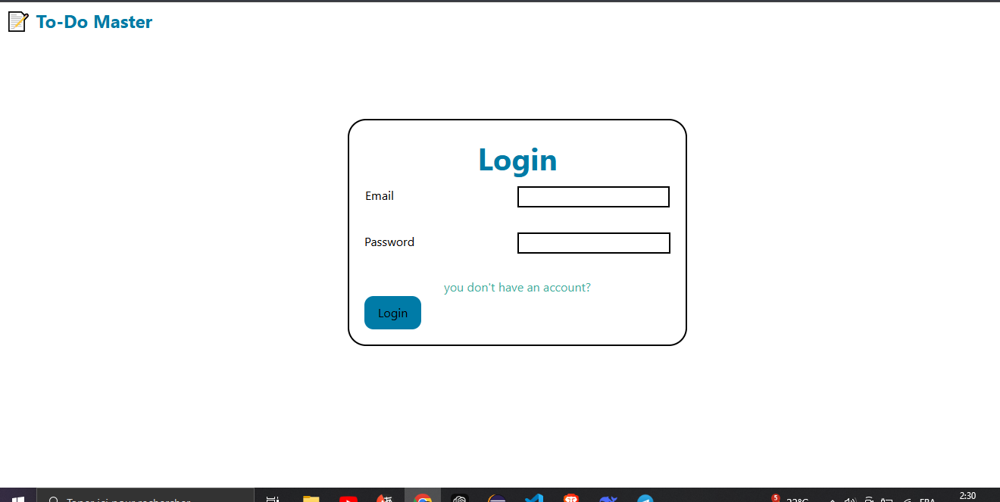
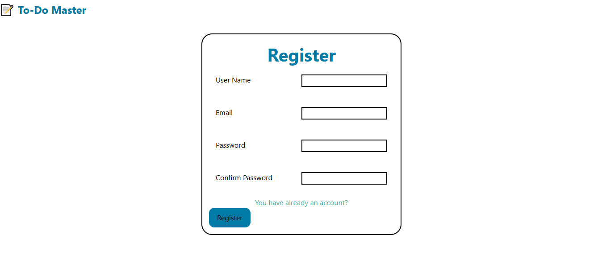

# React + Vite

# 📝 To-Do List App (React + localStorage)

A simple and lightweight To-Do List app built with **React.js** and styled using **Tailwind CSS**. This project allows users to create, delete, and mark tasks as done, with each user's tasks stored separately using `localStorage`.

---

## 🚀 Features

- ✅ Add new tasks
- ❌ Delete tasks
- 🔄 Mark tasks as done (toggle status)
- 👤 Support for multiple users
- 💾 Saves all tasks in `localStorage` for persistence

---

## 🖼️ Screenshots

| Home Page                          | Task Done (Line-through)           |
| ---------------------------------- | ---------------------------------- | --- | ------------------------------------- |
|  |  |     |  |

---

## 🛠️ Built With

- [React.js](https://reactjs.org/)
- [Tailwind CSS](https://tailwindcss.com/)
- Browser's `localStorage`
